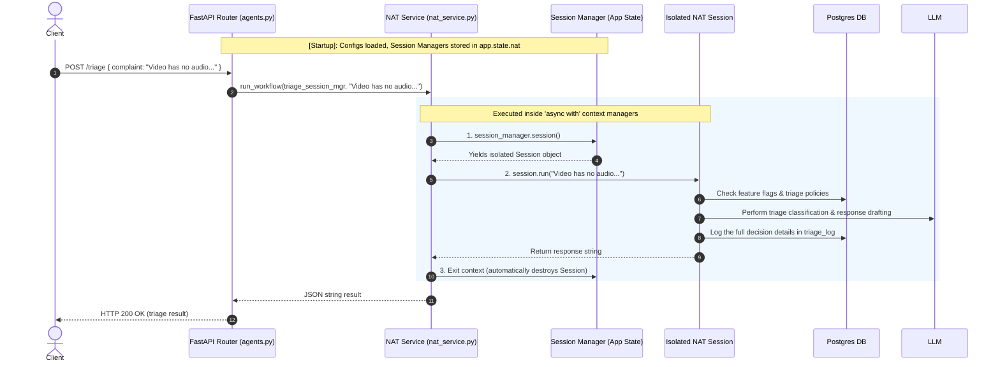

# FastAPI & NAT Workflow Interaction

This document explains how the FastAPI web server interacts with the NAT (Next Agent Toolkit) workflow system to process triage and chat actions. 

---

## 1. The Kitchen Analogy (A Simple Example)

Think of this system like running a busy restaurant kitchen:

*   **FastAPI (The Restaurant Front Desk):** Handles customers walking in, taking orders (HTTP requests), and delivering food (HTTP responses).
*   **NAT Workflows (The Pizza Oven):** The agent workflows (triage / copilot) are like a massive pizza oven. It is very expensive and slow to pre-heat (load configurations, compile LLM nodes, test connections), so you only turn it on once when the restaurant opens and leave it hot all day.
*   **The Lifespan (Opening/Closing the Restaurant):** When the restaurant opens, the owner pre-heats the oven. When the restaurant closes, they unplug it.
*   **A Session (Cooking an Order):** When a customer orders a pizza, the chef doesn't build a new oven from scratch. Instead, they open a single cooking slot (**Session**) inside the pre-heated oven, cook the pizza, clean the slot, and deliver it.

---

## 2. Core Concepts & Code Walkthrough

### Step A: Pre-heating at Startup (Lifespan Context)
When FastAPI starts up, the server runs the `lifespan` context manager in [main.py](file:///c:/Users/benny/OneDrive/Desktop/Projects/Versos%20Round%203/backend/main.py#L23-L33):

```python
@asynccontextmanager
async def lifespan(app: FastAPI):
    # 1. Warm up database connections
    app.state.pool = await create_pool(settings.asyncpg_dsn)
    
    # 2. Pre-heat/Load the NAT workflows
    app.state.nat = NatWorkflows()
    await app.state.nat.startup(settings.triage_config_path, settings.agent_config_path)
    
    yield  # The app is now running and accepting HTTP requests
    
    # 3. Shutdown / Unplug everything
    await app.state.nat.shutdown()
    await app.state.pool.close()
```

*   **`app.state`**: A global storage space inside FastAPI. By saving the loaded workflows here, we don't have to reload YAML configurations or recompile LLM prompts for every single HTTP request.

### Step B: The AsyncExitStack Seam
Inside [nat_service.py](file:///c:/Users/benny/OneDrive/Desktop/Projects/Versos%20Round%203/backend/services/nat_service.py#L13-L27), the `NatWorkflows` class manages the startup and shutdown using an `AsyncExitStack`:

```python
class NatWorkflows:
    def __init__(self) -> None:
        self._stack = AsyncExitStack()
        self.triage = None
        self.agent = None

    async def startup(self, triage_config: str, agent_config: str) -> None:
        # Load workflows and register them in the cleanup stack
        self.triage = await self._stack.enter_async_context(load_workflow(triage_config))
        self.agent = await self._stack.enter_async_context(load_workflow(agent_config))

    async def shutdown(self) -> None:
        # Closes all context managers loaded during startup
        await self._stack.aclose()
```

*   **`load_workflow(path)`**: This returns a long-lived **Session Manager** (stored in `self.triage` and `self.agent`).
*   **`AsyncExitStack`**: A Python helper that acts as a collection of context managers. It ensures that when `aclose()` is called, all loaded workflows clean up their connections and resources properly.

### Step C: Route Dependency Injection
When a user calls `/triage` in [agents.py](file:///c:/Users/benny/OneDrive/Desktop/Projects/Versos%20Round%203/backend/routers/agents.py#L12-L14), FastAPI injects the session manager using a dependency:

```python
@router.post("/triage")
async def triage(body: TriageReq, sm=Depends(nat_service.get_triage)):
    out = await nat_service.run_workflow(sm, body.complaint)
    return json.loads(out)
```

*   `Depends(nat_service.get_triage)` pulls the pre-heated **`triage` session manager** from `app.state` and hands it to the route function as `sm`.

### Step D: Cooking inside a Session Context
To actually execute a workflow, we use `run_workflow` in [nat_service.py](file:///c:/Users/benny/OneDrive/Desktop/Projects/Versos%20Round%203/backend/services/nat_service.py#L29-L33):

```python
async def run_workflow(session_manager, message: str) -> str:
    # 1. Open a temporary, isolated cooking slot (Session)
    async with session_manager.session() as session:
        # 2. Run the customer's text message through the workflow
        async with session.run(message) as runner:
            # 3. Wait for the result and extract it as a string
            return await runner.result(to_type=str)
```

#### Why are there two `async with` blocks here?
1.  **`session_manager.session()`**: Creates a single-use session. This isolates this specific user's run. If 100 users hit the `/triage` endpoint at the same time, this ensures they each get their own private session context (no variables or memory leak into other users' runs).
2.  **`session.run(message)`**: Starts the execution loop of the workflow steps. The runner handles passing the input text, triggering guardrails, talking to the LLM, reading/writing database logs, and returning the output.
3.  **Automatic Cleanup**: Once the code exits these `async with` blocks, the session is instantly closed and destroyed, keeping memory usage minimal.


---

## 3. Deep Dive: Context Managers & AsyncExitStack

To fully understand how `request.app.state.nat.triage` stays alive and processes requests, we need to look at **Context Managers**.

### 1. What is a Context Manager? (The `with` statement)
A context manager is a Python structure designed to handle **resource management** (ensuring things are set up and then cleaned up properly, even if errors occur).

*   **Example (Synchronous):** Reading a file.
    ```python
    with open("example.txt", "r") as file:
        data = file.read()
    # The file is AUTOMATICALLY closed here, even if file.read() crashed!
    ```
    Under the hood, Python calls two methods:
    1.  `__enter__`: Opens the file and returns it.
    2.  `__exit__`: Closes the file.

---

### 2. What is an Asynchronous Context Manager? (The `async with` statement)
When setting up or cleaning up a resource requires talking to a network or database asynchronously, we use **Async Context Managers**. They work exactly the same way, but allow you to `await` actions during setup and cleanup.

*   **Example (Asynchronous):** Opening an async HTTP session or Database connection.
    ```python
    async with aiohttp.ClientSession() as client:
        async with client.get("https://api.example.com") as response:
            text = await response.text()
    # The network connection is AUTOMATICALLY closed asynchronously here.
    ```
    Under the hood, Python calls two async methods:
    1.  `__aenter__` (runs setup asynchronously).
    2.  `__aexit__` (runs cleanup asynchronously).

---

### 3. The Startup Problem: Why we need `AsyncExitStack`
The `load_workflow()` function in NAT is an asynchronous context manager. Normally, you have to write it with `async with`:

```python
async with load_workflow(config_path) as triage:
    # 🚨 Problem: We can only use 'triage' INSIDE this nested indent block.
    # But a web server needs to return from startup and keep running!
```
If we returned from the function, the block would exit and the workflow would close immediately. We cannot nest the entire lifetime of a web server inside a single `async with` indentation.

#### The Solution: `AsyncExitStack.enter_async_context()`
An `AsyncExitStack` lets us enter context managers **programmatically** without nesting our code.

```python
# Instead of: async with load_workflow(config_path) as triage:
self.triage = await self._stack.enter_async_context(load_workflow(triage_config))
```
*   **What this does:** It enters the async context manager (`load_workflow`), resolves the underlying object (`triage` session manager), and keeps it active.
*   It registers the cleanup function inside `self._stack`.
*   We can then save `self.triage` as a class variable so FastAPI routes can access it anytime via `request.app.state.nat.triage`.
*   When the server shuts down, we call `await self._stack.aclose()`, which automatically runs the cleanup (`__aexit__`) for all loaded workflows.

---

### 4. How `request.app.state.nat.triage` processes a request
Now we can see the lifetime of `triage`:

1.  **At Startup:** `triage` is loaded using `enter_async_context`. It is now in a "warmed up / listening" state and saved globally at `request.app.state.nat.triage`.
2.  **During an HTTP Request:** 
    A user hits the `/triage` route. FastAPI injects `triage` as the `session_manager` argument:
    ```python
    async with session_manager.session() as session:
        async with session.run(message) as runner:
            return await runner.result(to_type=str)
    ```
    *   **`session_manager.session()`**: Opens a *nested* async context manager (a single temporary session) specifically for this request.
    *   **`session.run(message)`**: Opens another *nested* async context manager (the execution loop).
    *   Once the response is returned and we exit the `async with` block, the temporary session is cleaned up, but the parent `request.app.state.nat.triage` stays alive to receive the next request.

---

## 4. Flow of Control (Visual Diagram)

The diagram below illustrates the lifespan startup flow and how an individual request is routed and processed through the isolated session context managers.



